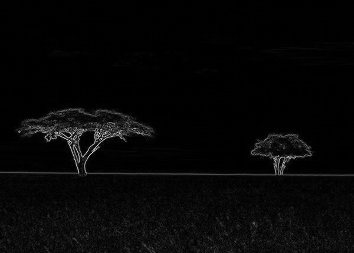
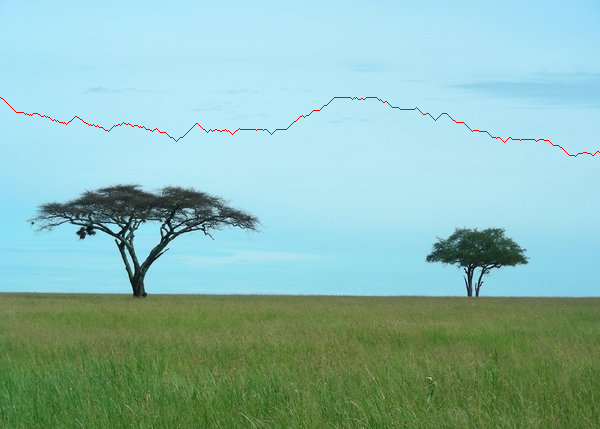
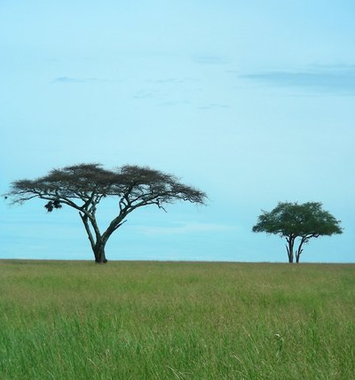
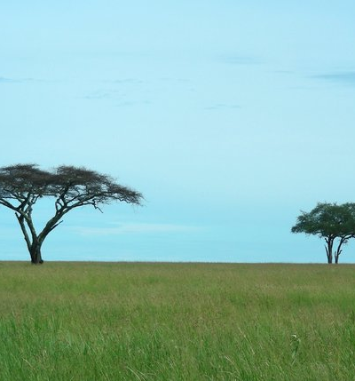

# Seam-Carving
Seam carving is an image processing technique for content aware image resizing.

## Table of Contents
1. [Description](#description)
2. [How to build and run](#build)
3. [Process of reducing image size and example output](#example)
4. [Comparison with different image resizing methods](#comparison)

<div id="description">

## Description
This project performs content aware image resizing. It functions by establishing a number of seams (paths of least importance) in an image and automatically removes seams to reduce image size.

<div id="build">
  
## How to build and run 

1. Clone the repository
2. Inside the repository run ```./gradlew build``` and then ```./gradlew run --args="-in <filename.png> -out <filename-out.png> -width <deltaWidth> -height <deltaHeight>"``` where: <br/>
```<filename.png>``` is your input image, <br/>
```<filename-out.png>``` is your output image, <br/>
```<deltaWidth>``` is diffrence in images width, <br/>
```<deltaHeight>``` is diffrence in images height. <br/>


<div id="example">
  
## Process of reducing image size and example output

1. First the program calculates each pixels importance, resulting in grey-scale image. The brighter the pixel the more important it is.<br/>

2. Then the path of least importance is calculated using Dijkstra's shortest path algorith which results in finding a single seam. The algorithm technically calculates vertical seam only, but the horizontal saem can also be calculated by transposing an image before finding a seam.<br/>


3. Then the seam is removed. This process is reapeted number of times to get and image reduced to desired size. Results: <br/>



<br/>

<div id="comparison">

## Comparison with different image resizing methods

|Cropped Image|Compressed Image|Seam Carving|
|:-:|:-:|:-:|
||||


