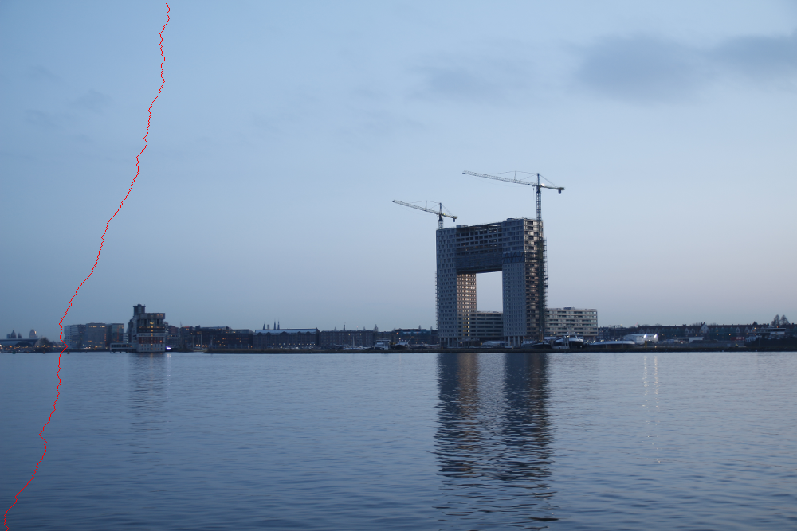

# Seam-Carving
Seam carving is an image processing technique for content aware image resizing.

## Description
Curretntly the project has Work in Progress status
By far it transforms an image to version that displays pixel energy as grey-scale image. Energy is the pixel's importance. You can see example below.
Then it finds the first vertical seam and paints it. The seam is the lowest energy path one image
  
  

 
